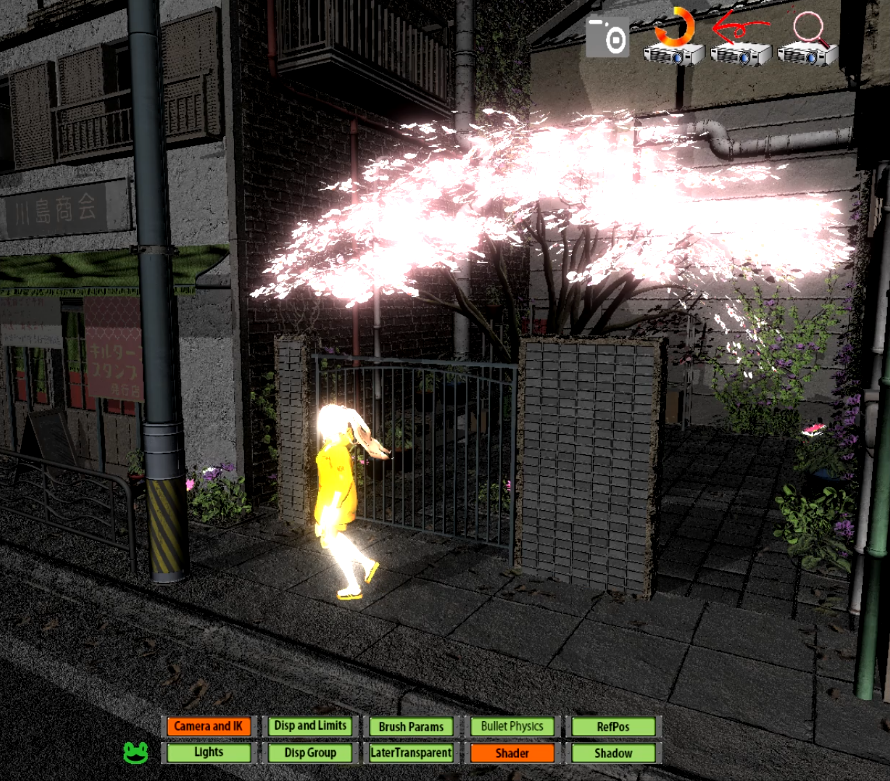

# AdditiveIK
Software to IK motion capture as if it were brushed.  DirectX 12. FBX Input/Output. Bullet physics compatible. 
 
モーションキャプチャをブラシで盛るようにIK編集するソフト. 
DirectX12対応. fbx入出力. BulletPhysics対応. 
前作EditMot+HLSL魔導書+DirectX12魔導書というところからのリスタート. 
MITランセンス. 
 
# ScreenShot
 
Fig.1 ScreenShot of AdditiveIK. 
 
 
Fig.2 HDRP Bloom (UnityAsset JapaneseCityを読込. model:VRoid). 
 
 
# 免責 
このソフトにより問題が起きたとしてもその責任は持ちません。 
自己責任でお願いします。 
 
 
# Concept 
モーションキャプチャを編集してゲーム用モーションに. 
モーションを何も無いところから作るのは難しい. 
それでも自分のゲームのモーションは自分で作りたい. 
モーキャプの動きを活かしつつ　ゲーム性をブラシで盛る. 
元のモーションを潰さずに盛るように編集する方法で  モーションキャプチャがゲーム用モーションになる. 
FBXファイルにしてUnityへ. 
全てのフレームにキーがあるモーションキャプチャの編集には専用ソフトが必要. 
AdditiveIKはそのためのソフトです.  
 
 
# Usage 
入力用のfbxの準備の仕方 
　UnityAssetをUnityでfbxエクスポートする場合 
　全てのマテリアルのシェーダーをStandardにするとfbxにテクスチャ名が出力される 
　それ用のEditorスクリプトをみつけてきて使っています 
メニュー 
　２段構成プレートメニュー 
　１段目は常時固定メニュー. ２段目はカエルボタンクリックで変化. 
　メニューに対するGUIは右ペインウインドウに表示. 
IK編集 
　編集したいフレーム(時間横軸)範囲をロングタイムラインの四角マークをマウスで囲むようにドラッグして選択 
　Brushプレートメニューで編集ウェイト曲線のパラメータを設定 
　ジョイントマークをマウスドラッグしてIK 
コピーペースト 
　ソフトを終了しても残るコピー履歴機能により手間を削減 
　コピーの際にメモを記述可能で履歴画面に表示される 
表示 
　DispAndLimitプレートメニューのShaderTypeでAuto, PBR, STD, NOLIGHTを切り替え可能に. 
　法線マップを設定していないモデルに対してPBRを選択すると　法線が０となり黒い表示になることに注意 
　ShaderTypeでAUTOを選んだ場合のシェーダー設定は以下 
　　スキンメッシュについては　[Albedo無しまたはNormal有またはMetal有]->PBR,　[Albedoだけ有またはテクスチャ１つも無し]->NOLIGHT 
　　非スキンメッシュについては　[Albedo無しまたはNormal有またはMetal有]->PBR,　[Albedoだけ有またはテクスチャ１つも無し]->STD 
　スキンメッシュと非スキンメッシュそれぞれのShaderTypeに対して　不透明、半透明、半透明常時上書きの設定があり自動設定 
　DispGroupプレートメニューでメッシュごとにグループ指定 
　　設定画面としてはモデルパネルで選択したモデル単位 
　　複数モデルを横断してグループ番号の小さい順に描画 
　　グループ番号１以外は強制的に半透明として描画 
　　メッシュ右クリックから類似する名前のメッシュの一括処理が可能 
　LaterTransparentプレートメニューでメッシュ内の透過テクスチャ描画順を指定
 
 
 
# UpdateLog 
[UpdateLog.txt](UpdateLog.txt) 
 
 
 
# 開発環境(ソフトウェア) 
　fbxを扱うにはMayaが必須と言えます 
　Mayaは趣味の人？に対しては安価で？提供されている 
　（インディー契約の条件については以下のページ） 
　https://area.autodesk.jp/product/maya-3ds-max-indie/ 
 
 
　開発環境(2023/11/12時点)を書きます。 
　OS Windows11 Pro 
　VisualStudio2022Pro(VisualStudioSubscription) 
　MayaIndie(Subscription FBXの確認はMayaでする) 
　Unity3D 2022LTS(2022.3.3) 
　プロが作ったアセットをUnityAssetStoreでゲットしてUnity3Dでfbx出力 https://assetstore.unity.com/?locale=ja-JP  
　FBXSDKは2020.3.4(VC2022) https://www.autodesk.com/products/fbx/  
　Microsoft MultiThreadLibrary PPL. 
 
　DirectX12 (githubのMicrosoftのDirectXTK12) 
　DirectXTK12のライセンスはReadMe/DirectXTK12_LICENSE 
 
　DirectXTex (githubのMicrosoftのDirectXTex) 
　DirectXTexのライセンスはReadMe/DirectXTex_LICENSE 
 
　githubのbullet physics ver2.89 https://pybullet.org/wordpress/  
　bullet physicsのライセンスはReadMe/bulletPhysics_license.txt 
 
　HLSLシェーダーの魔導書のMiniEngine https://github.com/shoeisha-books/hlsl-grimoire-sample  
　魔導書コードのライセンスはReadMe/hlsl-grimoire_LICENSE 
 
　DirectX12の魔導書のサンプルを使用 
　ライセンスはReadMe/dx12-grimoire_LICENSE 
 
　MicrosoftのDXUT11のDXUTTimerを使っています. 
 
 
　Testディレクトリのモデル作成にVRoidStudioを使用します 
　https://vroid.com/studio 
 
 
# 開発環境(ハードウェア) 
古めの８コアIntelマシン 
　GeForce RTX 2080 8GB 
　128GB RAM 
　1T SSD 
 
 
# Description
[Description at OchakoLAB](https://ochakkolab.jp/LABMenu/MameBake3D.html "Desc-1")

# Channel
[Youtube Channel](https://www.youtube.com/@ochakkolab "Channel")

# Site
[OchakkoLAB](https://ochakkolab.jp/ "OchakkoLAB")
 
 
 
 
 
 
メール：info@ochakkolab.jp 
Author: おちゃっこ@おちゃっこLAB 
 
 
 
 
 
 