# AdditiveIK
Software to IK motion capture as if it were brushed.  DirectX 12. FBX Input/Output. Bullet physics compatible. 
 
モーションキャプチャをブラシで盛るようにIK編集するソフト. 
DirectX12対応. fbx入出力. BulletPhysics対応. 
前作EditMot+HLSL魔導書+DirectX12魔導書というところからのリスタート. 
MITランセンス. 
 
# ScreenShot
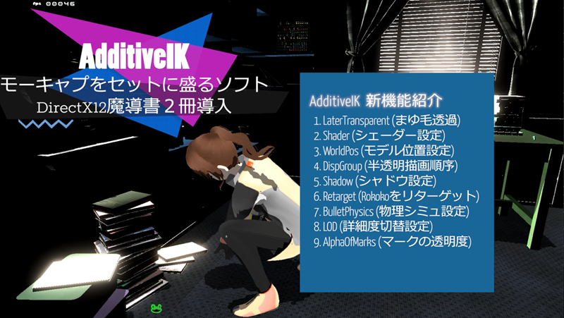 
Fig.0 New Feature of AdditiveIK. 
 
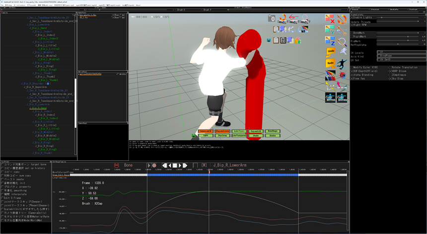 
Fig.A モーションキャプチャ＋物理シミュをベイク (model:VRoid). 
 
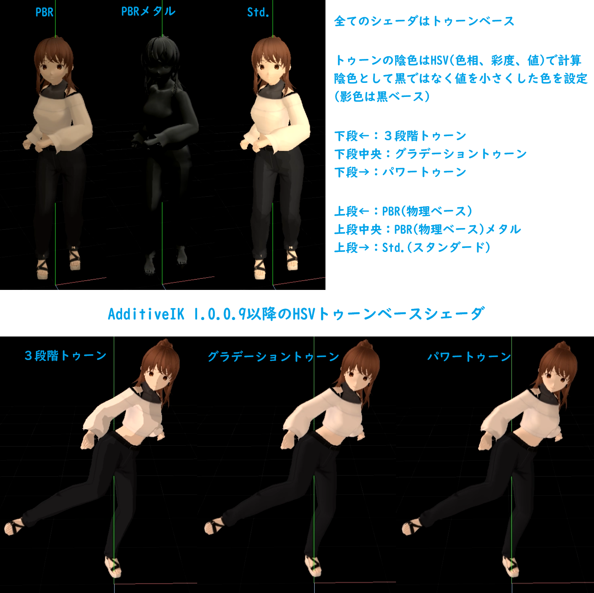 
Fig.1 ver1.0.0.9以降のシェーダまとめの図 (model:VRoid). 
 
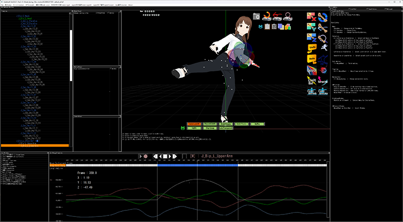 
Fig.2 ScreenShot of this Application(OnLargeWindowMode). 
 
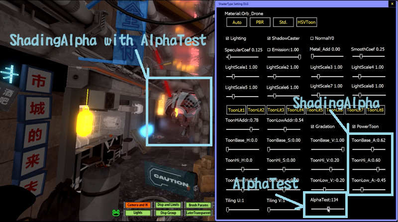 
Fig.3 ShadingAlpha with AlphaTest　(UnityAsset TheHuntを読込. model:VRoid 
　　　ShadingAlpha:ライトの当たり方に応じてリアルタイム透明度変化 
　　　AlphaTest:指定透明度よりも小さい透明度の描画をスキップ). 
 
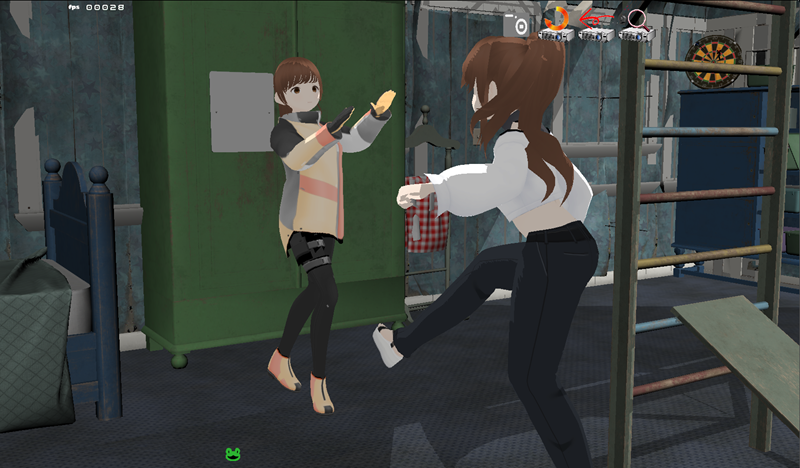 
Fig.4 Multiple Model (UnityAsset HQ Retro Farmhouseを読込. model:VRoid). 
 
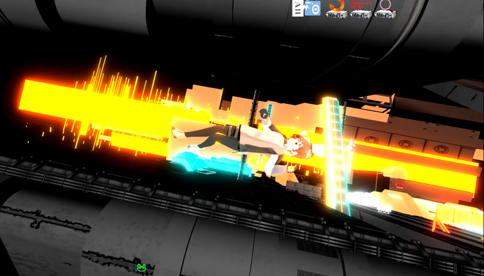 
Fig.5 PlayFbxCameraAnim (UnityAsset TheHuntを読込. model:VRoid). 
 
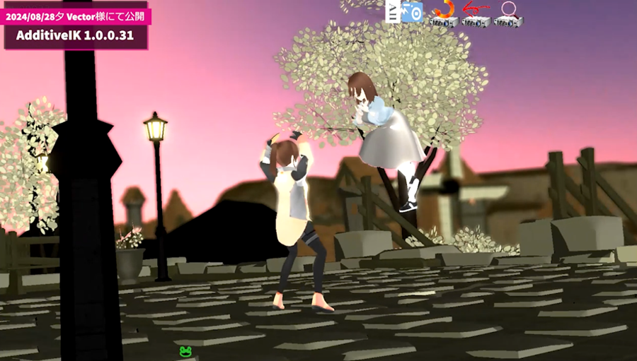 
Fig.6 (UnityAsset FantasyTownを読込  model:VRoid). 
 
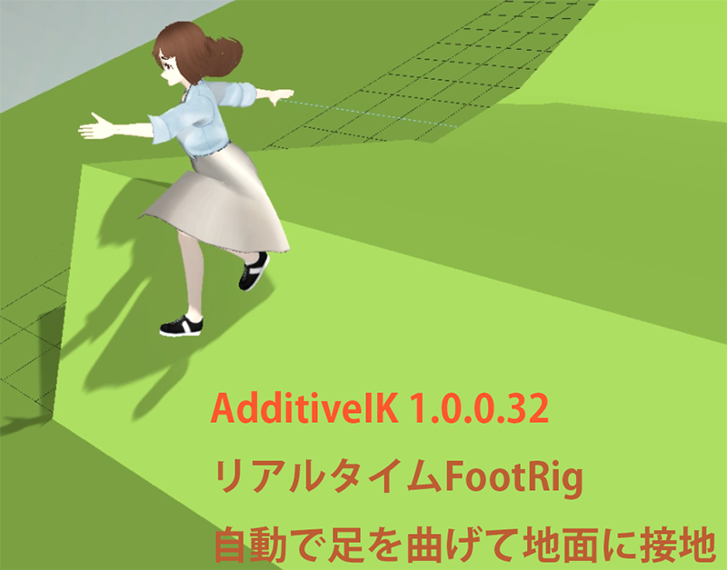 
Fig.7 (FootRigで足を曲げて自動接地  model:VRoid). 
 
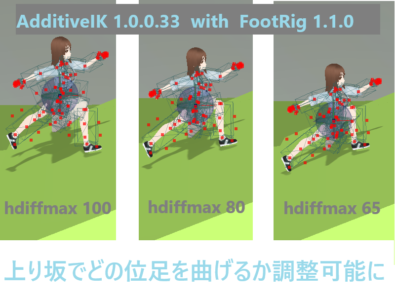 
Fig.8 (足曲げを調整可能なFootRig model:VRoid). 
 
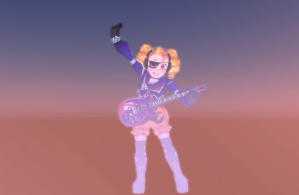 
Fig.9 (モーションアクセラレータMOA2.0 model作成:ぼおんさん). 
MOA2.0 https://youtu.be/GFEmF8dnV_M 
 
# 免責 
このソフトにより問題が起きたとしてもその責任は持ちません。 
自己責任でお願いします。 
 
 
# Concept 
モーションキャプチャを編集してゲーム用モーションに. 
モーションを何も無いところから作るのは難しい. 
それでも自分のゲームのモーションは自分で作りたい. 
モーキャプの動きを活かしつつ　ゲーム性をブラシで盛る. 
元のモーションを潰さずに盛るように編集する方法で  モーションキャプチャがゲーム用モーションになる. 
FBXファイルにしてUnityへ. 
全てのフレームにキーがあるモーションキャプチャの編集には専用ソフトが必要. 
AdditiveIKはそのためのソフトです.  
 
 
# Usage (使い方) 
入力用のfbxの準備の仕方 
　UnityAssetをUnityでfbxエクスポートする場合 
　全てのマテリアルのシェーダーをStandardにするとfbxにテクスチャ名が出力される 
　それ用のEditorスクリプトをみつけてきて使っています 
メニュー 
　２段構成プレートメニュー 
　１段目は常時固定メニュー. ２段目はカエルボタンクリックで変化. 
　メニューに対するGUIは右ペインウインドウに表示. 
IK編集 
　編集したいフレーム(時間横軸)範囲をロングタイムラインの四角マークをマウスで囲むようにドラッグして選択 
　Brushプレートメニューで編集ウェイト曲線のパラメータを設定 
　Brush設定によるウェイトカーブはタイムライン上に白い線で表示 
　ジョイントマークをマウスドラッグしてIK 
　元の動きを潰さずにドラッグした分だけの姿勢をウェイトを掛けて足す. 
　IK階層数を大きくしてもIKStop設定ジョイントでドラッグ効果は止まる. 
　IKStopはジョイント右クリックでオンオフ. 
アンドゥリドゥ 
　モーション編集とブラシ設定とフレーム選択に関して処理の巻き戻しと再実行が可能 
　アンドゥ及びリドゥボタンはCameraAndIKプレートメニューで表示 
　画面左上にR(数字)、W(数字)の表示がある　読込バッファ番号と書き込みバッファ番号を示す 
　R位置番号はアンドゥするたびに１つ減る 
　W位置番号は常にバッファの最後の番号 
　R番号W番号は　アンドゥリドゥによって　どの状態に戻ったのかを確認するためのもの 
高回転モードと計算スレッド数 
　姿勢計算はマルチスレッド化されていて描画と同時進行で計算 
　DispAndLimitsプレートメニューのHighRpmチェックは姿勢計算のスレッド回転を速くする 
　HighRpmはプレビュー時(プレイヤーボタンのプレイを押したとき)に機能する 
　HighRpmオン時にはプレビュー時にCPU稼働率が高くなり描画が速くなる 
　DispAndLimitsプレートメニューのUpdateThreadsスライダーで計算スレッド数を設定 
　UpdateThreadsは１モデルに対してのスレッド数 
　読み込みモデル数とコンピュータのCPUコア数によって速く描画できるスレッド数は異なる 
角度制限 
　読み込み済のモーションの動く範囲を可動範囲としてワンボタン設定可能 
　LimitEulerプレートメニューの 
　FromCurrentMotionボタンとFromAllRetargetedMotionでワンボタン設定 
　角度制限はCameraAndIKプレートメニューのLimitEulボタンでオンオフする 
　IK時に設定した制限角度で止まる 
　CameraAndIKプレートメニューのScrapingボタンオンの時には 
　１つでも可動軸があるとその軸に関して動く 
　指などの制限が厳しい設定下で動かしたい場合にScrapingを使用 
位置コンストレイント 
　ジョイント右クリックでコンストレイントジョインを指定 
　位置コンストレイントはIK時またはConstExecuteボタン押下時に働く 
　CameraAndIKプレートメニューのConstRefreshを押したときの位置にジョイントをコンスト 
　LimitEulをオンにして使うことを想定(無理な方向へ曲がらないように) 
カスタムRig 
　操作用メッシュを表示したいジョイントを右クリックしてCreateNewRigで作成設定 
　マウスのX方向Y方向それぞれのドラッグに対してXYZの度の軸を回転するかを指定 
　回転には符号付きの倍率を設定 
　RigによるIKは5階層まで伝達可能だがRigからRigも呼ぶことが出来るので５階層以上も可能 
　Rig操作のオンオフはCameraAndIKプレートメニューのRigボタンで行う 
コピーペースト 
　ソフトを終了しても残るコピー履歴機能により手間を削減 
　コピーの際にメモを記述可能で履歴画面に表示される 
　コピー履歴表示のソートカットボタンは上段カエルボタンを押して表示 
　最新を選択のチェックを外すと過去の履歴を選ぶことが出来るようになる 
SymCopy 
　対称コピー 
　選択フレーム範囲のモーションに対して対称コピーを行う　ペーストボタンで貼り付け 
　ショートカットボタンは上段カエルボタンで表示 
　ボタンを押して出てくるメニューでSymDirAndSymPosAndSymScale選択推奨 
補間 
　補間(Interpolation)ショートカットボタンは上段カエルボタンで表示 
　補間計算は選択フレーム範囲の最初と最後のフレームに対して行う 
　補間計算時にはBrushプレートメニューで選択したウェイト曲線を使用 
　通常の補間をしたい場合にはZBrushにUpCos選択 TopPosを100にして補間ボタン押下 
Smooth平滑化 
　平滑化ボタンはCameraAndIKプレートメニューにある 
　ボタンを右クリックで設定してから実行、左クリックは前回の設定で実行 
　ノイズの除去に効果がある 
　補間とは違って姿勢を考慮せずにオイラー角を直接計算するのでHipsに使うと体が傾くことがある 
物理シミュレーション 
　bulletPhysicsによる物理シミュレーション 
　RigidParamsプレートメニューで設定 
　Validにチェックを入れてToAllボタンで全身に剛体が入る 
　髪の毛ジョイントはneckジョイント選択後ToolWindowのjointマークスキップresetを押すと表示 
　シミュレーションしたいボーン(剛体)に対してRigidBodySimulationチェックボックスにチェック 
　プレイヤーボタンのグレーの再生ボタンで物理シミュ開始 
　BulletPhysicsプレートメニューのCalcCountスライダーで１フレーム当たりの物理計算回数を設定 
　CalcCountは通常１.
　大きいCalcCount値で安定することもあるが環境依存で大きくすることにより暴れることもある 
カメラ履歴 
　アセットの編集場所へすばやくカメラを移動可能 
　上段カエルボタンでカメラ履歴ボタンを表示 
　CameraAndIKプレートメニューのカメラボタンドラッグでカメラ設定後 
　履歴ウインドウのGetボタンで値として取得　Saveでメモ付き保存 
　ラジオボタン選択で履歴の場所にカメラ移動 
表示 
　DispAndLimitプレートメニューのShaderTypeでAuto, PBR, STD, NOLIGHTを切り替え可能に. 
　法線マップを設定していないモデルに対してPBRを選択すると　法線が０となり黒い表示になることに注意 
　ShaderTypeでAUTOを選んだ場合のシェーダー設定は以下 
　　スキンメッシュについては　[Albedo無しまたはNormal有またはMetal有]->PBR,　[Albedoだけ有またはテクスチャ１つも無し]->NOLIGHT 
　　非スキンメッシュについては　[Albedo無しまたはNormal有またはMetal有]->PBR,　[Albedoだけ有またはテクスチャ１つも無し]->STD 
　スキンメッシュと非スキンメッシュそれぞれのShaderTypeに対して　不透明、半透明、半透明常時上書きの設定があり自動設定 
　DispGroupプレートメニューでメッシュごとにグループ指定 
　　設定画面としてはモデルパネルで選択したモデル単位 
　　複数モデルを横断してグループ番号の小さい順に描画 
　　グループ番号１以外は強制的に半透明として描画 
　　メッシュ右クリックから類似する名前のメッシュの一括処理が可能 
　LaterTransparentプレートメニューでメッシュ内の透過テクスチャ描画順を指定 
　Shaderプレートメニュー 
　　マテリアル名ボタン押下で設定、見出しボタン押下で選択モデルの全マテリアルに対して設定 
　　シェーダータイプとしてAuto, PBR, Std., NoLightの４種類から選択 
　　PBRは法線テクスチャまたはメタルスムーステクスチャのどちらかが設定されている場合を想定 
　　Autoを選ぶと設定具合をみて自動的にマテリアルごとにPBR, Std.,NoLightを振り分け 
　Shadowプレートメニュー 
　　デプスシャドウです　セルフシャドウも表示されます 
　　影の向きはLightプレートメニューで設定したライトの番号で指定(1から8までのボタン) 
　　シャドウ用のカメラの位置から上記ライトの向きに影は落ちます 
　　シャドウライト位置と対象物間に遮るオブジェクトがある場合plus up設定でライトを持ち上げる 
　　影の明るさは0.0で真っ黒、1.0でdiffuse色 
　　シャドウカメラの位置設定にはカメラのターゲット位置が関係する 
　　ジョイントを選択後にDispAndLimitsメニューのLockCameraToSelectedJointチェックで
　　選択したジョイントの位置をカメラターゲット位置にすることが可能 
　　カメラのターゲット位置によっても影の落ち方は変わる 
　HDRP 
　　Lightプレートメニューで設定可能なライトの強さは1.0よりも大きい3.0. 
　　Shaderプレートメニューで設定可能なマテリアルごとのライト倍率最大値は5.0. 
　　SahderでStd.を選んで　ライトを1.0より大きくすると　自動的にBloomが掛かる. 
　bvh2Fbxバッチ 
　　bvhファイルをfbxファイルに変換. 
　　扱うことが出来るbvhのタイプは限定的(回転順序には対応.軸の違いには未対応). 
　　CMU(カーネギーメロン大学)のMotionBruilderFriendlyタイプのサンプルでテスト. 
　retargetバッチ 
　　指定フォルダ内のfbxを選択中のモデルにリターゲット 
　　モーションのボーン名とモデルのボーン名の対応表*.rtg(テキストファイル)が必要 
　　Test/RetargetSettingFileExampleフォルダに*.rtgの例を同梱 
　　Testフォルダの*.rtgのファイル名は Model名_モーション種類.rtg 
　　指定フォルダにretarget.rtgという名前で*.rtgファイルを置く必要有 
 
 
 
# UpdateLog 
[UpdateLog.txt](UpdateLog.txt) 
 
 
 
# 開発環境(ソフトウェア) 
　fbxを扱うにはMayaが必須と言えます 
　Mayaは趣味の人？に対しては安価で？提供されている 
　（インディー契約の条件については以下のページ） 
　https://area.autodesk.jp/product/maya-3ds-max-indie/ 
 
 
　開発環境(2024/06/26時点)を書きます。 
　OS Windows11 Pro 
　VisualStudio2022Pro(VisualStudioSubscription) 
　MayaIndie(Subscription FBXの確認はMayaでする) 
　Unity3D 2022LTS(2022.3.30) 
　プロが作ったアセットをUnityAssetStoreでゲットしてUnity3Dでfbx出力 https://assetstore.unity.com/?locale=ja-JP  
　FBXSDKは2020.3.4(VC2022) https://www.autodesk.com/products/fbx/  
　Microsoft MultiThreadLibrary PPL. 
 
　DirectX12 (githubのMicrosoftのDirectXTK12) 
　DirectXTK12のライセンスは3rd_LICENSE/DirectXTK12_LICENSE 
 
　DirectXTex (githubのMicrosoftのDirectXTex) 
　DirectXTexのライセンスは3rd_LICENSE/DirectXTex_LICENSE 
 
　githubのbullet physics ver2.89 https://pybullet.org/wordpress/  
　bullet physicsのライセンスは3rd_LICENSE/bulletPhysics_license.txt 
 
　HLSLシェーダーの魔導書のMiniEngine https://github.com/shoeisha-books/hlsl-grimoire-sample  
　魔導書コードのライセンスは3rd_LICENSE/hlsl-grimoire_LICENSE 
 
　DirectX12の魔導書のサンプルを使用 
　ライセンスは3rd_LICENSE/dx12-grimoire_LICENSE 
 
　MicrosoftのDXUT11のDXUTTimerを使っています. 
 
　gltf(vrm)の読み込みにtinygltfを使用 https://github.com/syoyo/tinygltf 
　ライセンスは3rd_LICENSE/tinygltf_LICENSE 
 
　SonyPlayStation用のゲームパッドDualSenseを使用するために
　sonichopeさんのDS4HidInputを使用　https://github.com/sonichope/DS4HidInput 
　ライセンスは3rd_LICENSE/DS4HidInput_LICENSE 
 
　Testディレクトリのモデル作成にVRoidStudioを使用します 
　https://vroid.com/studio 
 
 
# 開発環境(ハードウェア) 
2025/3/1からの環境 
　一世代前のIntelCPU 20コア 28スレッド 
　　GeForce RTX 4070 12GB 
　　DDR5-6000 64GB RAM(2025/3/21) 
　　1T SSD(多分足りない　増設予定) 
　　Sony GameController DualSense 
　　TourBoxNEO 左手用デバイス(2025/04/16) https://www.tourboxtech.com/jp/ 
2025/2/28までの環境 
　古めの８コアIntelマシン 
　　GeForce RTX 2080 8GB 
　　128GB RAM 
　　1T SSD 
 
 
# Description
[Description at OchakoLAB](https://ochakkolab.jp/LABMenu/AdditiveIK.html "Desc-1")  
[Technical Specs 2024/08/18](https://ochakkolab.jp/diary_win.html#AdditiveIK_2024_08_18 "Desc-2") 
 
# Explaining Movie
[Movie About New Feature](https://youtu.be/oKGY62YosSg "About New Feature1") 

[ジャンプ中にくるりと回ります 2024/04/26](https://youtu.be/6wveLqMbsYA "Usage example1") 

[限界越えたら0.1倍速で動きます 2024/05/04](https://youtu.be/ufPtA-CxVKU "Usage example2") 

[クリック位置に草が生えるんです 2024/05/13](https://youtu.be/_-YDEyL16G8 "Usage example3") 

[モーキャプ編集+fbxカメラ編集 2024/06/09](https://youtu.be/_G4wev5w-4g "Usage example4") 

[空の色は何色ですか？ 2024/06/17](https://youtu.be/0LkwVw9eubg "Usage example5") 

[屋根の上に飛べますか？ 2024/06/20](https://youtu.be/YLJxziIqBsQ "Usage example6") 

[fbxカメラ基本編集機能の修正と確認 2024/08/02](https://youtu.be/rb1UI_p5Acc "Usage example7") 

[カメラがくるっと周った後の編集について 2024/08/18](https://youtu.be/VrAYFkpyVwc "Usage example8") 

[OXの風景 2024/08/26](https://youtu.be/HZxVflJui40 "Usage example9") 

[FootRigで接地して歩く 2024/09/04](https://youtu.be/TJjTwD0gioI "Usage example10") 

[リアルタイムFootRig 1.2.0 at AdditiveIK 2024/10/17](https://youtu.be/VH21YgC-jvA "Usage example11") 

[MOA2.0 2025/01/13](https://youtu.be/GFEmF8dnV_M "Usage example12") 

[SonyDualSenseでリアルタイム階段接地 2025/02/11](https://youtu.be/WTpdyVGKlcs "Usage example13") 

[ちょっと前のAdditiveIKのオペ画面 2025/05/06](https://youtu.be/40jmur2J2CY "Usage example14") 
 
# Site
[OchakkoLAB](https://ochakkolab.jp/ "OchakkoLAB")
 
 
メール：info@ochakkolab.jp 
Author: おちゃっこ@おちゃっこLAB 
 
 
# Special thunks 
　Test/1_MOA_B2フォルダのサンプルのB2.fbxは、ぼおんさん著作のbucho.sigファイルをfbxにしたものです。 
 
 
 
 
 
 
 
 
 
 